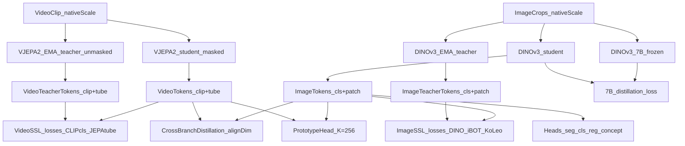
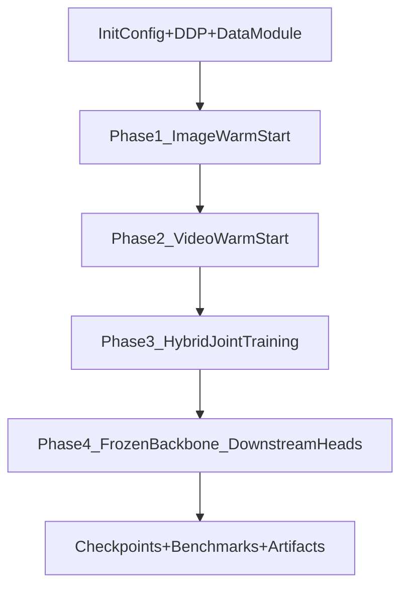
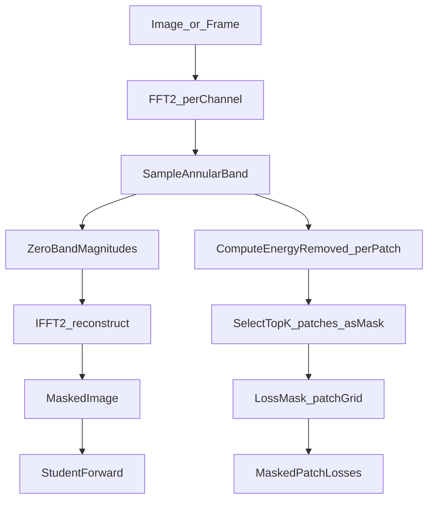
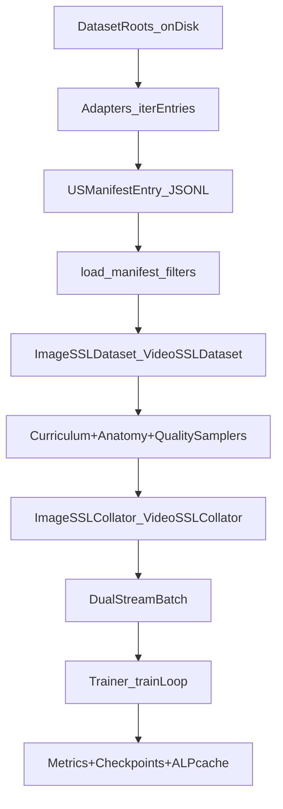

# Ultatron

**Ultatron — Ultrasound Foundation Model** (v0.1.0)  
*DINO-guided JEPA with Semantic Prototype Distillation*

Ultatron is a **dual-stream (image + video) self-supervised foundation model** for ultrasound, designed to learn anatomy- and modality-robust representations across diverse clinical datasets, and then support downstream fine-tuning for **segmentation, classification, and regression**.

This repository contains:
- A full **data → manifest → datamodule** pipeline ([`data/`](data/))
- A **dual-branch SSL model** (DINOv3 image + V-JEPA2 video) ([`models/`](models/))
- A **4-phase training curriculum** at CSCS scale ([`train/`](train/), [`scripts/`](scripts/))
- **Evaluation and benchmarks** ([`eval/`](eval/))
- **Visualization utilities** for attention/prototypes/segmentation dashboards ([`viz/`](viz/))

---

## Quickstart

### Install

```bash
pip install -e .
```

### Run tests

```bash
pytest
```

### Build a manifest

The system operates on JSONL manifests (`USManifestEntry`) produced by dataset adapters.

```bash
python scripts/build_manifest.py --config configs/data/data_config.yaml --out /tmp/us_train.jsonl --split train
python scripts/build_manifest.py --config configs/data/data_config.yaml --out /tmp/us_val.jsonl --split val
```

### Train (single node / debug)

```bash
python scripts/train.py --config configs/experiments/full.yaml
```

### Validate (linear probe)

```bash
python -m eval.linear_probe --help
```

> At scale, training is orchestrated via SLURM on CSCS Alps (see [`scripts/run_training_job.sh`](scripts/run_training_job.sh)).

---

## Repository layout

```text
ultatron/
├── README.md
├── pyproject.toml
├── configs/
│   ├── data/data_config.yaml              # datamodule + transforms + curriculum + dataset list
│   ├── models/model_config.yaml           # backbone selection + align/proto dims
│   ├── experiments/*.yaml                 # pretrain experiment overrides
│   └── finetune/*.yaml                    # downstream finetune configs
├── data/
│   ├── adapters/                          # dataset-specific manifest builders
│   ├── schema/                            # manifest schema + ontology
│   ├── labels/                            # label/task specifications
│   └── pipeline/                          # datasets, transforms, samplers, collators, datamodule
├── models/
│   ├── image_backbones/                   # DINOv3, RadDINO, SwinV2 (stub)
│   ├── video_backbones/                   # VJEPA2
│   ├── branches/                          # ImageBranch + VideoBranch + shared heads
│   ├── heads/                             # segmentation/classification/regression/concept heads
│   └── losses/                            # SSL losses (DINO/iBOT/JEPA/cross-branch/prototypes)
├── train/
│   ├── trainer.py                         # canonical training orchestrator
│   ├── phase_steps.py                     # pure training-step functions per phase
│   ├── alp.py                             # ALP cache + hardness feedback loop
│   └── gram.py                            # Gram anchoring teacher and loss
├── finetune/                              # downstream finetune experiments
├── eval/                                  # metrics + benchmarks + linear probe
├── viz/                                   # training/feature/attention/prototype dashboards
├── scripts/
│   ├── build_manifest.py                  # CLI: build JSONL manifests
│   ├── train.py                           # CLI: training entry point
│   └── run_training_job.sh                # SLURM script for CSCS Alps
└── tests/                                 # adapter + dataset + backbone contract tests
```

---

## Configuration at a glance

### Model selection

Model selection is driven by YAML config (registry keys):
- [`configs/models/model_config.yaml`](configs/models/model_config.yaml)
- [`configs/data/data_config.yaml`](configs/data/data_config.yaml) (`model:` block)

Defaults from `configs/data/data_config.yaml`:
- **image_backbone**: `dinov3_l`
- **video_backbone**: `vjepa2_l`
- **frozen_teacher**: `dinov3_7b`
- **ema_momentum**: `0.9995`
- **align_dim**: `256` (data config) / `512` (model config)
- **n_prototypes**: `256`
- **dtype**: `bfloat16`

> If both configs are used, the training entry point determines which field wins via config merge rules.

### Data & curriculum defaults

From [`configs/data/data_config.yaml`](configs/data/data_config.yaml):
- **image_batch_size**: 64 per GPU (example global batch: \(64 \times 512 \times 4 = 131{,}072\))
- **video_batch_size**: 8 per GPU
- **patch_size**: 16
- **training steps**: 300,000
- **resolution curriculum** (image `max_global_crop_px`): 512 → 672 → 896
- **video crop cap** (`max_crop_px`): 512 (and 672 later per curriculum comments)
- **frequency masking**: enabled, with annular-band parameters under `freq_mask`

---

## Model architecture

Ultatron is a dual-stream SSL system:
- **Image branch**: DINOv3 student + EMA teacher, with optional **frozen 7B teacher distillation**
- **Video branch**: V-JEPA2 student + EMA teacher (masked-context prediction)
- **Shared alignment**: cross-branch distillation into an `align_dim` space and a prototype consistency head

### High-level model diagram



### What lives where

- **Branches**: [`models/branches/`](models/branches/)
  - `ImageBranch`: student + EMA teacher (+ optional frozen 7B teacher)
  - `VideoBranch`: student + EMA teacher (masked vs unmasked input)
  - `CrossBranchDistillation`, `PrototypeHead`: shared alignment modules
- **Backbones**: [`models/image_backbones/`](models/image_backbones/), [`models/video_backbones/`](models/video_backbones/)
- **Heads**: [`models/heads/`](models/heads/)
- **Losses**: [`models/losses/`](models/losses/)

### Backbone registry keys

Image (`models/image_backbones/`):
- `dinov3_s`, `dinov3_splus`, `dinov3_b`, `dinov3_l`, `dinov3_hplus`
- `rad_dino`
- `swin_v2_l` (stub)

Video (`models/video_backbones/`):
- `vjepa2_l`, `vjepa2_h`, `vjepa2_g`

Frozen teacher:
- `dinov3_7b` (or `null` to disable)

---

## Training pipeline (4 phases)

Training is orchestrated by [`train/trainer.py`](train/trainer.py) with phase step logic in
[`train/phase_steps.py`](train/phase_steps.py). The canonical CLI entry point is
[`scripts/train.py`](scripts/train.py).

### Phase diagram



### Default loss terms (conceptual)

Ultatron combines image SSL, video SSL, and cross-modal alignment:

| Symbol | What it is | Where |
|---|---|---|
| \(L_{cls}\) | DINO-style CLS alignment (student vs EMA teacher) | `models/losses/image_losses.py` |
| \(L_{patch}\) | iBOT-style masked patch loss | `models/losses/image_losses.py` |
| \(L_{local}\) | multi-crop consistency across local crops | `models/losses/image_losses.py` |
| \(L_{7b}\) | distillation to frozen DINOv3-7B | image branch + phase steps |
| \(L_{clip}\) | video clip representation loss (student vs EMA teacher) | `models/losses/video_losses.py` |
| \(L_{tube}\) | JEPA tube prediction loss on masked tubes | `models/losses/video_losses.py` |
| \(L_{cross}\) | cross-branch distillation in `align_dim` | `models/losses/cross_branch.py` |
| \(L_{proto}\) | prototype assignment consistency (image vs video) | `models/losses/proto_loss.py` |
| \(L_{gram}\) | Gram anchoring to a snapshot teacher | `train/gram.py` |
| \(L_{koleo}\) | uniformity regularizer (KoLeo) | `models/losses/image_losses.py` |

Loss weights are configured in training configs and phase logic (see `phase_steps.py` / config YAML).

### Resolution curriculum

From [`configs/data/data_config.yaml`](configs/data/data_config.yaml):
- steps **0–30k**: `max_global_crop_px = 512`
- steps **30k–150k**: `max_global_crop_px = 672`
- steps **150k–270k**: `max_global_crop_px = 896`
- steps **270k–300k**: backbone frozen; downstream heads

---

## Native-scale resolution (why + how)

### Why “native scale” for ultrasound

Ultrasound images/videos vary wildly in:
- acquisition resolution and aspect ratio
- field-of-view (depth, zoom, probe type)
- speckle statistics and artifact patterns

A single forced resize (e.g. always to 224×224) can erase **scale-dependent cues** (speckle grain size, boundary sharpness, attenuation patterns) that are informative for robust representation learning.

### How it’s implemented

Native-scale crops are produced by the transform layer:
- Crops are sampled **without resizing**
- Crops are snapped/padded to **patch-size multiples** (`patch_size: 16`)
- Batches are padded to the maximum size in the batch and the model receives a **padding mask** to prevent attention and loss on padded tokens

This design lives in:
- [`data/pipeline/transforms.py`](data/pipeline/transforms.py)
- padding-aware collation in [`data/pipeline/collators.py`](data/pipeline/collators.py)

---

## Frequency-based masking (rationale + mechanics)

Ultatron’s default masking strategy is **frequency-domain masking** (`masking="freq"`), designed to be more physics-aligned than purely random spatial masking.

### Rationale

Ultrasound structure is tightly coupled to frequency content:
- **low frequency**: anatomy shape / gross structure
- **mid frequency**: speckle texture and tissue appearance
- **high frequency**: edges, boundaries, fine artifacts

Instead of randomly zeroing patches, Ultatron:
- removes a *band* of Fourier magnitudes (annular ring) and
- derives a patch mask from where energy was removed

This forces reconstruction/prediction to rely on meaningful, multi-scale signals rather than shortcut cues.

### Masking flow chart



### ALP-biased masking (saliency + hardness)

The transform stack supports an ALP-biased variant where band selection is biased toward regions/frequencies that are:
- salient under teacher attention, and/or
- hard for the student to predict

This is driven by the ALP cache and feedback loop in [`train/alp.py`](train/alp.py).

---

## Adaptive Learning Priority (ALP)

ALP is a feedback loop that turns model signals into smarter sampling/masking:
- **Hardness**: per-patch prediction error
- **Saliency**: teacher attention-derived importance
- **Stage-dependent blend**: \(\alpha\) schedules saliency→hardness mixing during curriculum

Core components:
- `ALPScoreCache`: stores per-sample arrays for saliency/hardness
- `HardnessFeedback`: writes hardness/saliency signals during training
- `HardnessAwareSampler`: biases sampling toward hard examples late in training

See [`train/alp.py`](train/alp.py) and its integration points in training.

---

## Gram anchoring

Long-horizon SSL training can drift in ways that degrade patch-token geometry (e.g., less stable locality/structure). Ultatron includes **Gram anchoring** as a stabilizer:
- A snapshot “Gram teacher” is periodically created from the student
- The student is penalized if its patch-token Gram matrix drifts too far

Configured in [`configs/data/data_config.yaml`](configs/data/data_config.yaml):
- `start_step: 100000`
- `refresh_interval: 50000`
- `lambda: 1.0`

Implemented in [`train/gram.py`](train/gram.py).

---

## Data pipeline (end-to-end)

Ultatron trains from **JSONL manifests** with a unified schema (`USManifestEntry`).

### Dataflow diagram



### Where to look in code

- **Manifest schema**: [`data/schema/manifest.py`](data/schema/manifest.py)
- **Adapters**: [`data/adapters/`](data/adapters/)
- **Datasets + DataModule**: [`data/pipeline/dataset.py`](data/pipeline/dataset.py), [`data/pipeline/datamodule.py`](data/pipeline/datamodule.py)
- **Transforms**: [`data/pipeline/transforms.py`](data/pipeline/transforms.py)
- **Samplers**: [`data/pipeline/samplers.py`](data/pipeline/samplers.py)
- **Collators**: [`data/pipeline/collators.py`](data/pipeline/collators.py)

### Datasets included (default config)

From [`configs/data/data_config.yaml`](configs/data/data_config.yaml), the default dataset roots include:
`CAMUS`, `EchoNet-Dynamic`, `EchoNet-LVH`, `MIMIC-IV-ECHO`, `Unity-Imaging`, `BUS-BRA`, `FETAL_PLANES_DB`,
`COVIDx-US`, `TN3K`, `TN5000`, `DDTI`, `KidneyUS`, `HC18`, `ACOUSLIC-AI`.

---

## Downstream fine-tuning & evaluation

### Fine-tuning

Downstream fine-tuning experiments live in [`finetune/`](finetune/) and are configured by
[`configs/finetune/*.yaml`](configs/finetune/).

Examples included:
- **BUSI**: breast lesion segmentation + classification
- **CAMUS**: cardiac segmentation
- **EchoNet-Dynamic**: EF regression (video)
- **TN3K**: thyroid nodule segmentation

### Evaluation

Evaluation tooling is under [`eval/`](eval/):
- `eval/metrics.py`: Dice/IoU/HD95, AUC/AP, MAE/RMSE/R², EF-specific metrics
- `eval/linear_probe.py`: anatomy-stratified linear probe (LogisticRegression) for SSL fitness
- `eval/benchmarks/`: dataset-specific benchmark runners

---

## Infrastructure & scaling notes

- SLURM orchestration: [`scripts/run_training_job.sh`](scripts/run_training_job.sh)
- Typical target run: **512 nodes × 4 GH200 GPUs per node** (2,048 GPUs total)
- Checkpoint/requeue: SIGUSR1 triggers requeue; `latest.pt` resume behavior is baked into the job script
- HuggingFace weights are cached ahead of time on rank 0 per job

---

## Notes on `agents/` and SAM/MedSAM

The `agents/` folder currently contains placeholders (empty stubs). However, visualization utilities under
[`viz/`](viz/) include SAM prompt-related plotting utilities (e.g. attention-derived prompt placement), indicating
an intended future “agent loop” that uses backbone attention and/or concept detection to drive segmentation prompts.

---

## Development tips

- Use `pytest` to validate adapters/datasets/backbone contracts without requiring real dataset downloads.
- Prefer modifying behavior via YAML configs under [`configs/`](configs/) rather than hardcoding.
- If you are debugging shape/padding issues, start with:
  - [`data/pipeline/collators.py`](data/pipeline/collators.py)
  - [`data/pipeline/transforms.py`](data/pipeline/transforms.py)
  - backbone interfaces in [`models/base.py`](models/base.py)

